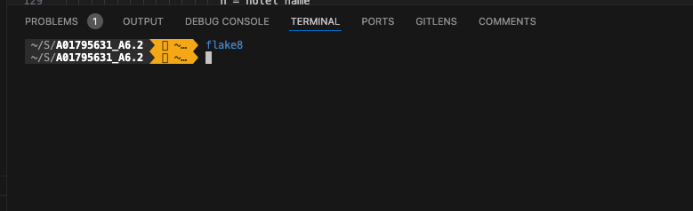
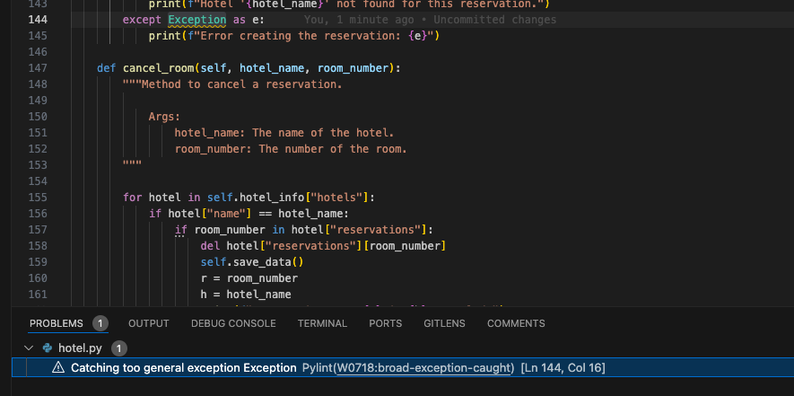

# A01795631_A4.2

Luis Nicanor Gutiérrez
Pruebas de software y aseguramiento de la calidad (Gpo 10)

## Objetivos
2.18 Explicar los fundamentos del desarrollo de pruebas unitarias 

2.19 Desarrollar pruebas unitarias para fragmentos de programas usando las mejores prácticas recomendadas.

## Ejercicios de programación

1. Reservation system
* Hotel
* Reservation
* Customers

Validaciones:

* Flake8

* Pylint

* Operaciones
  * Crear Hotel
  * Crear Customer
  * Crear reservación
  * Cancelar reservación

[Create reservation](https://github.com/luisnicg/A01795631_A6.2/blob/main/evidences/create_reservation.mp4)

[Cancel reservation](https://github.com/luisnicg/A01795631_A6.2/blob/main/evidences/cancel_reservation.mp4)

* Test cases
  * Create Hotel
  * Create customer
  * Delete customer
  * Update customer
  * Create reservation
  * Cancel reservation
  * Create reservation rooks doesn't exist
  * Create reservation already reserved
  * Cancel reservation not reserved

 [Test cases](https://github.com/luisnicg/A01795631_A6.2/blob/main/evidences/test_cases.mp4)